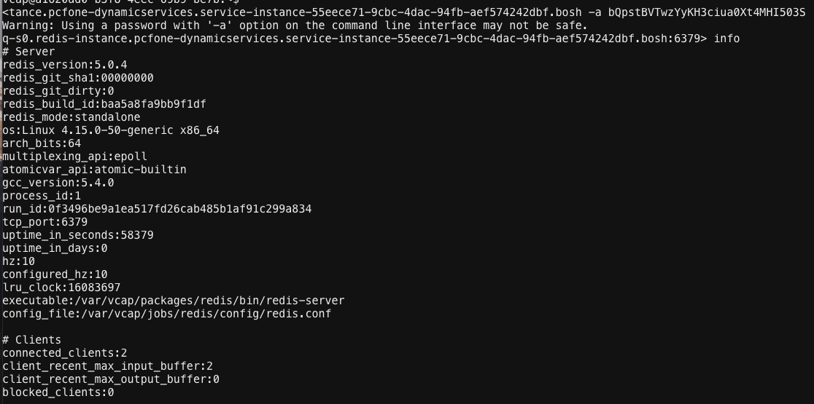

# cf-gotty-redis-cli

A tool to deploy `redis-cli` to Cloud Foundry and to use it for remote Redis instances diagnostic via Web Application.

## Deployment

1. download the release file
2. extract to a local folder
3. update `manifest.yml` if necessary
4. `cf push` the app to Cloud Foundry
5. bind to `redis` service and restart app

## Usage

* Get `Redis` Infomration from `VCAP_SERVICES`

for example:

```
  "system_env_json": {
    "VCAP_SERVICES": {
      "p.redis": [
        {
          "label": "p.redis",
          "provider": null,
          "plan": "cache-small",
          "name": "svc-redis",
          "tags": [
            "redis",
            "pivotal",
            "on-demand"
          ],
          "instance_name": "svc-redis",
          "binding_name": null,
          "credentials": {
            "host": "q-s0.redis-instance.pcfone-dynamicservices.service-instance-55eece71-9cbc-4dac-94fb-aef574242dbf.bosh",
            "password": "bQpstBVTwzYyKH3ciua0Xt4MHI503S",
            "port": 6379
          },
          "syslog_drain_url": null,
          "volume_mounts": []
        }
      ]
    }
  },
```

* Login the Web Interface Terminal, or use [gotty-client](https://github.com/moul/gotty-client) to connect Gotty

for example:

```
gotty-client https://<GOTTY_USERNAME>:<GOTTY_PASSWORD>@https://gotty-redis-cli.cf.exmaple.com
```

* Run `redis-cli` to Connect Remote Redis Server

`./redis-cli -h <host> -p <port> -a <password>`



## Redis Server Diagnostics

Useful `redis-cli` References:

* [redis-cli, the Redis command line interface](https://redis.io/topics/rediscli)
* [commands](https://redis.io/commands)

### Commands

```
info
ping
memory stats
```

### Continuous stats mode

`$ redis-cli --stat`

### Scanning for big keys

`$ redis-cli --bigkeys`

### Getting a list of keys

`$ redis-cli --scan | head -10`

### Monitoring commands executed in Redis

`$ redis-cli monitor`

### Monitoring the latency of Redis instances

`$ redis-cli --latency`


